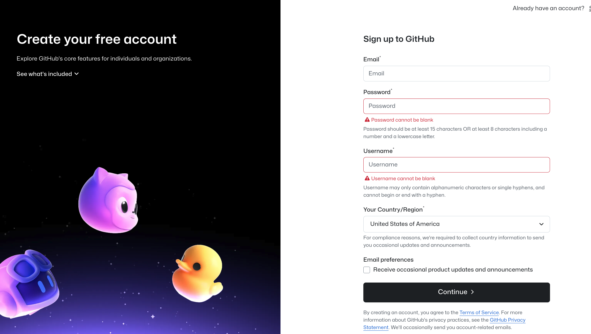

# GitHub

## What is GitHub?
[GitHub](https://github.com) is a hosting service for {term}`Git` repositories,
enabling us to share code across teams in a web environment.

## Why do I need a GitHub account?

There are three reasons you are required to have a GitHub account for the hackweek:

1. Your GitHub accounts will give you access to the hackweek cloud computing resources
2. All hackweek tutorials will be shared on GitHub
3. All project teams will use GitHub to collaborate and work together on their code

## Creating a GitHub account

Go to [GitHub](https://github.com/). Select "Sign Up" in the top right corner.

Next, enter your email address and click on the green 'Sing up for GitHub' button.
You will need to answer a few required questions in the following dialogs.
Be sure to save your password somewhere safe because you will need it later!

## How will GitHub repositories be structured?

Each repository is a container for a specific subset of material for this event. For example, there is a repository for the public-facing website you used to register for this event https://arm-development.github.io/arm-summer-school-2025. We'll also create new repositories for each project.
