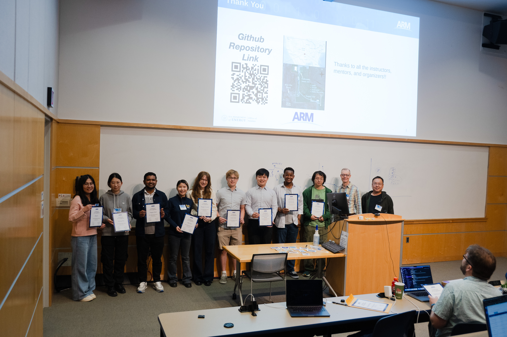
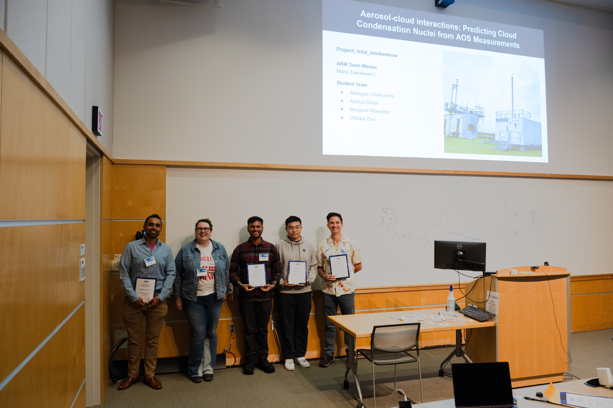
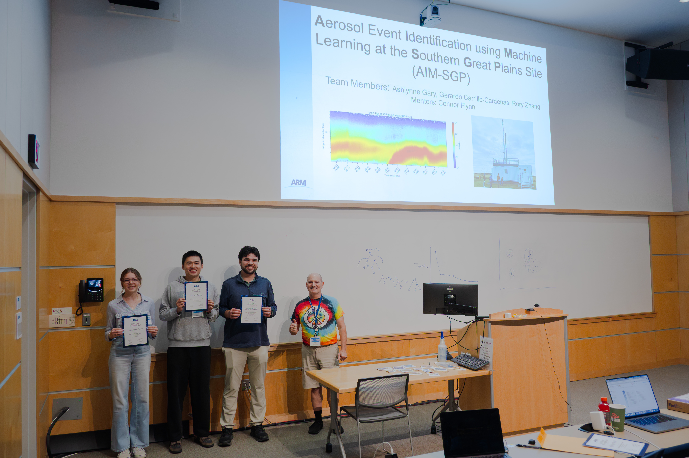
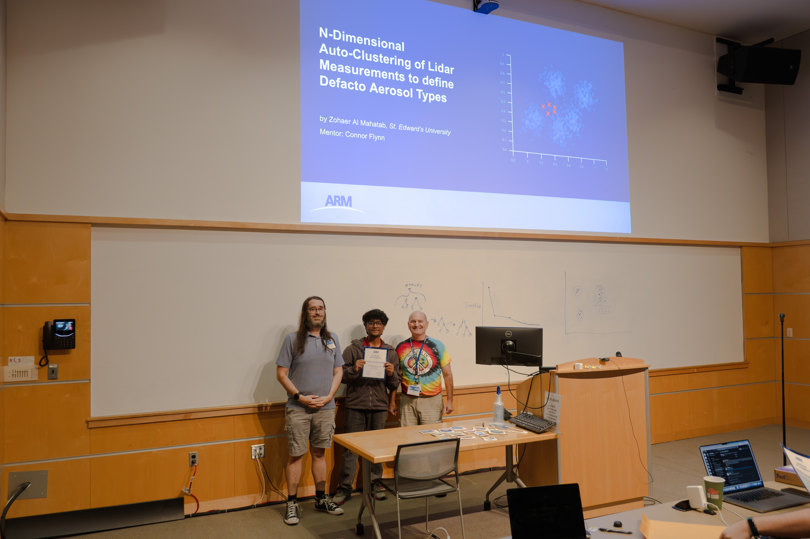
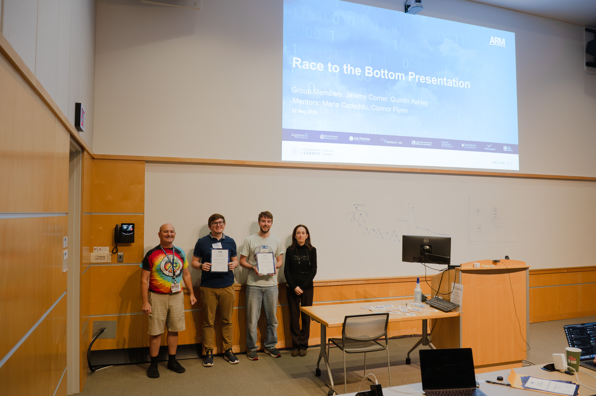

# Overview of 2026 Student Projects

## [Model Meets Reality (MMR): A Cross-Comparison of DP-SCREAM and WRF Against ARM Observations](https://arm-synergy.github.io/model-meets-reality/)

@powell_2026_mmr prepared DP-SCREAM simulations to pair with WRF sims from LASSO-ShCu for three cases. ARM has dozens of measurements that can be used to examine the representativeness of these simulations. Cross compare the two models and put their differences in context with the observations.

[Model Meets Reality Final Presentation](./presentations/model-meets-reality-cross-comparison-dpscream-wrf.pdf)

## [Aerosol-Cloud Interactions: Predicting Cloud Condensation Nuclei from AOS Measurements (Total Smokeshow)](https://arm-synergy.github.io/total_smokeshow/)

@chakraborty_2026_total_smokeshow Explainable XGBoost machine learning model for prediction of cloud condensation nucleai (at 10m) from other measurable aerosol quantities.

[Total Smokeshow Final Presentation](./presentations/Pres_Total_SmokeShow_ARM2026.pptx.pdf)

## [Aerosol Event Identification using Machine Learning at the Southern Great Plains Site (AIM-SGP)](https://arm-synergy.github.io/ai-new-particle-formation/)

@gary_2026_aim_sgp Random Forest Model Development for automatic daily New Particle Formation (NPF) event classification

[AIM-SGP Final Presentation](./presentations/NPF_Classification_RandomForest.pptx.pdf)

## [Atmospheric Radiation Measurement Synergy: Radar, Aerosol, Cloud and Energy (ARMS-Race)](https://arm-synergy.github.io/arms-race/)

@nairy_2026_arms_race developed a Random Forest Machine Learning Algorithm to Classify Arctic Cloud Phase at ARM’s North Slope Alaska Facility

[ARMS-Race Final Presentation](./presentations/ARMS_RACE_final_presentation.pptx.pdf)

## [N-Dimensional Auto-Clustering of Lidar Measurements to define Defacto Aerosol Types](https://arm-synergy.github.io/ndim-auto-cluster-lidar/)

@al_mahatab_2026_lidar_autoclustering K-means Clustering Algorithm designed to classify aerosol types within High-Spectral Resolution Lidar (HSRL) Observations

[N-Dim Auto Cluster Final Presentation](./presentations/ndim_clusters_aerosol_types.pdf)

## [Race to the Bottom](https://arm-synergy.github.io/race-2-the-bottom/)

@corner_2026_race_to_the_bottom Three-layer Neural Net with Long Short Term Memory designed to extend the Microwave Radiometers range of precipitable water vapor (PWV) detection.

[Race to the Bottom Final Presentation](./presentations/Race_to_the_Bottom_Presentation.pptx.pdf)

